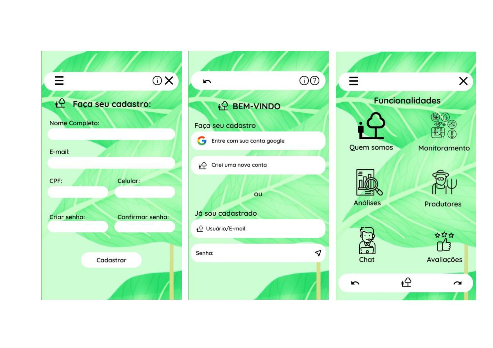
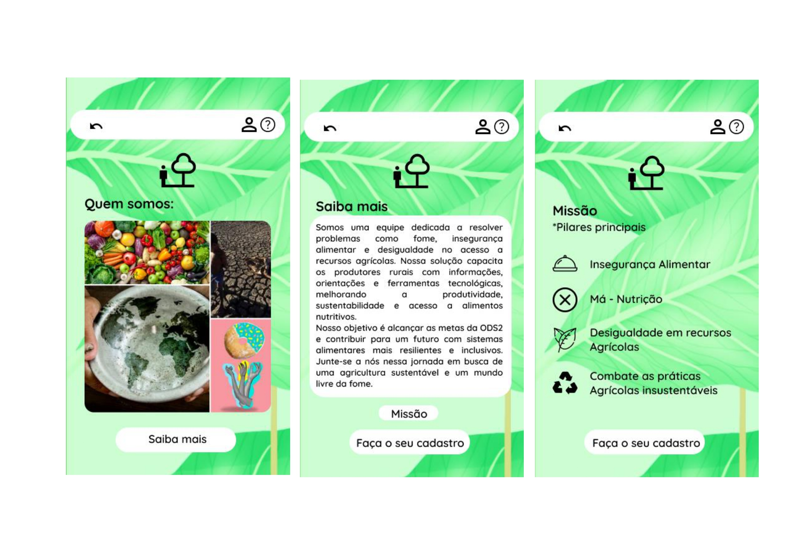
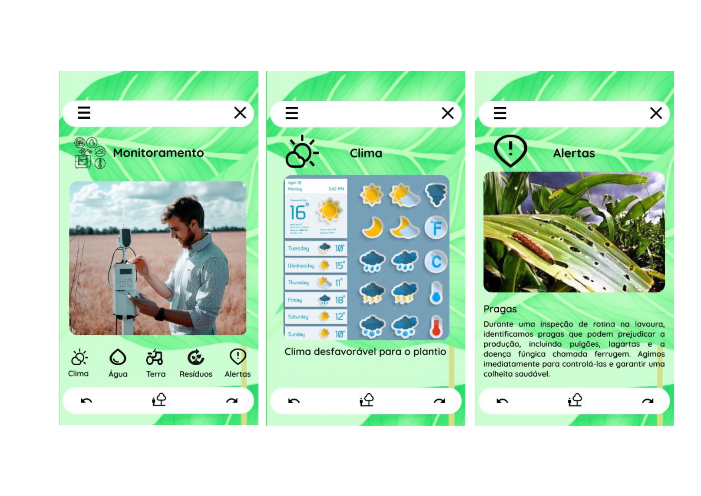
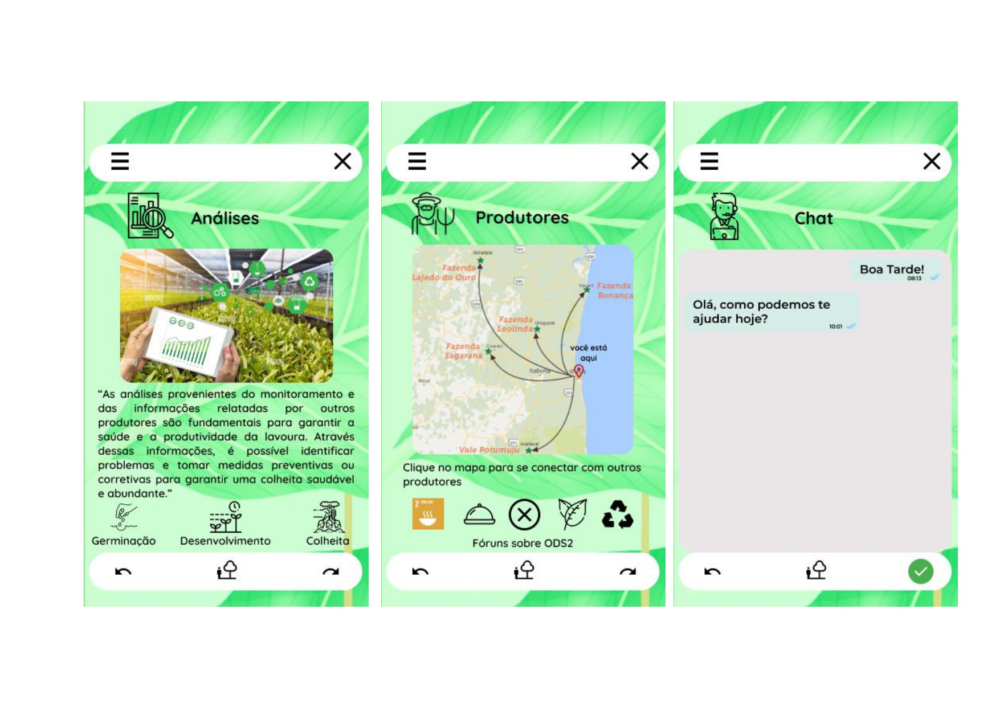
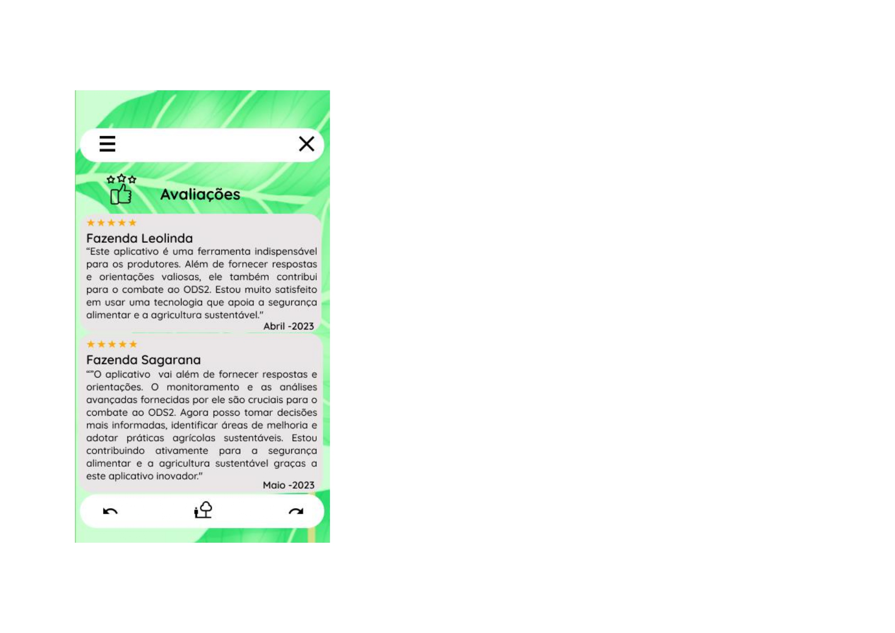

 <h3 align="center">
Protótipo criado em Figma para o primeiro projeto Global Solution-FIAP! </h3>
<h4>Desafio:</h4>Desenvolver uma solução em software que interaja com uma IA generativa. Analise as metas da ODS2 e encontre uma solução inovadora e que permita alcançar alguma meta.

##

<h4>Proposta:</h4>

💡O aplicativo proposto por nossa equipe visa resolver problemas como fome, insegurança alimentar e desigualdade no acesso a recursos agrícolas. Por meio de uma abordagem baseada em tecnologia, oferecendo aos produtores rurais ferramentas e informações valiosas para melhorar a produtividade, sustentabilidade e acesso a alimentos nutritivos.

:bug:Com recursos de monitoramento em tempo real, os agricultores podem acompanhar informações sobre clima, água, terra e resíduos, permitindo que tomem decisões mais informadas e adotem ações preventivas para proteger suas colheitas. Além disso, o aplicativo fornece alertas sobre pragas, contaminações e problemas climáticos, permitindo que os agricultores ajam rapidamente para minimizar perdas.

🌱Outra funcionalidade importante é a análise do ciclo de cultivo, monitorando o desenvolvimento das plantas, identificando os problemas e fornecendo orientações para evitar desperdícios e melhorar a eficiência. Dessa forma, os agricultores podem otimizar sua produção e garantir uma colheita mais saudável e abundante.

O aplicativo oferece um espaço de comunicação entre os produtores locais, onde podem compartilhar conhecimentos, discutir estratégias e promover ações relacionadas às metas do ODS2. Através de um fórum integrado, os agricultores podem colaborar e impulsionar o desenvolvimento de práticas sustentáveis e inovadoras.

Valorizar o feedback dos usuários e incentivar avaliações constantes para aprimorar o aplicativo, promovendo a agricultura sustentável em busca de um mundo livre da fome.

##

